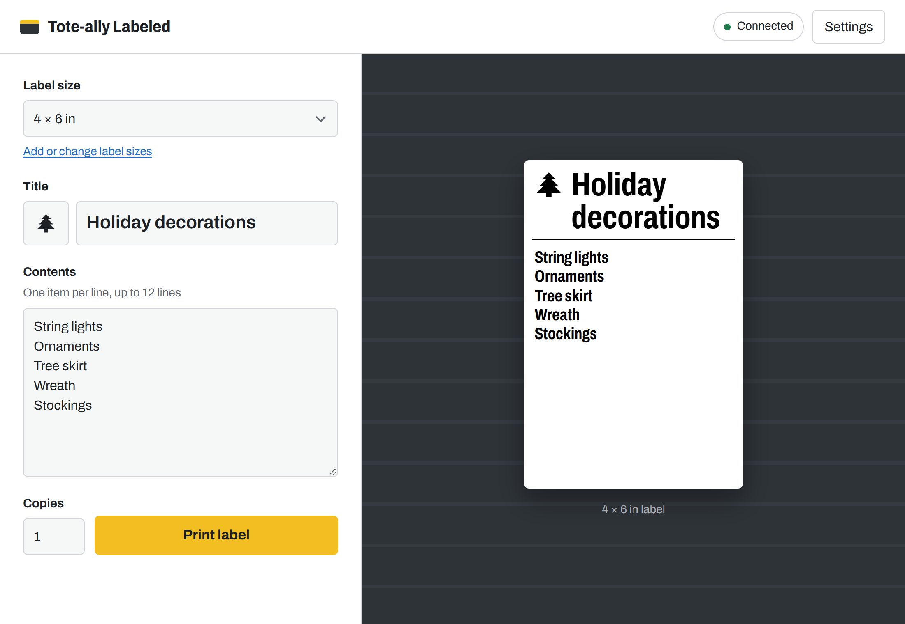
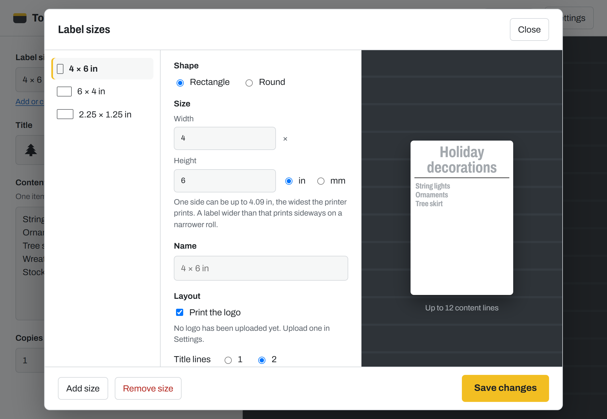
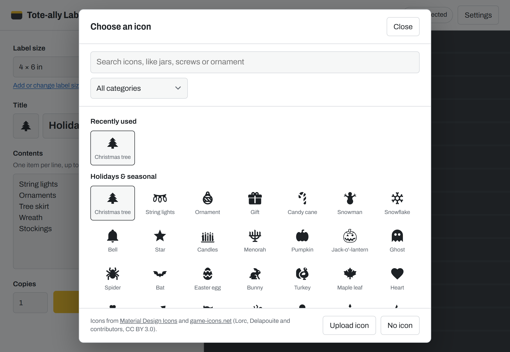
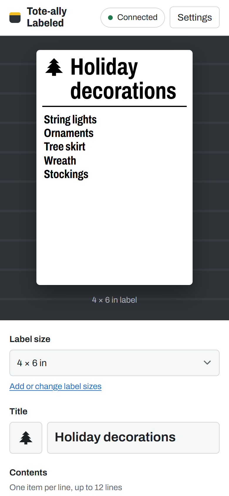

# Tote-ally Labeled

Print storage tote labels on a Zebra label printer. Type a title and a list of what's inside, choose an icon,
and print. Works with any label size, including round labels, and from a phone on the same network.

| Label sizes | Icon picker | On a phone |
|---|---|---|
|  |  |  |

## Install

1. Download the installer from the **[latest release](https://github.com/KurtJacobson/Tote-ally-Labeled/releases/latest)**
   (`Tote-ally-Labeled-Setup-<version>.exe`).
2. Run it. Windows SmartScreen warns on the first run because the installer isn't code-signed; choose
   **More info**, then **Run anyway**.
3. Leave **Allow phones and other computers on this network** ticked if you want to print from a phone.
   It opens TCP port 5050 in Windows Firewall for your local network only.
4. Open Tote-ally Labeled, then **Settings**:
   - **Printer IP address**: print a network configuration label from the printer's menu to find it, and
     use **Test** to check the connection.
   - **Print resolution**: 203 or 300 dpi, from the sticker under the printer.
   - **Calibrate printer** after loading a new roll.

To print from a phone, open `http://<this PC's IP address>:5050` in its browser while the app is open.

Requires 64-bit Windows 10 or 11. Setup downloads the Microsoft Edge WebView2 Runtime if the PC doesn't have it.
Installing a new version keeps your settings, label sizes, logo and icons.

## Printer compatibility

Tote-ally Labeled sends ZPL (Zebra Programming Language) to the printer over the network on TCP port 9100.

| Printer | Works? |
|---|---|
| Zebra network printers that speak ZPL: ZD, GK/GX and ZT series | Yes. Developed on a ZD621 at 300 dpi. |
| Other brands with ZPL emulation (some TSC, Godex, Honeywell, SATO) | Usually. Fonts, line wrapping and centring can differ from the preview, and Calibrate may do nothing. |
| Printers that only speak TSPL, EPL, DPL, ESC/POS or CPCL | No |
| Brother QL, DYMO and other driver-only printers | No |
| USB-only printers | No. The printer must be on the network. |

- Resolution: 203 or 300 dpi.
- Labels up to 4.09 in (103.9 mm) wide, the print width of the ZD621. Wider labels, up to 12 in, print sideways
  on a narrower roll.

## Credits

Built-in icons from [Material Design Icons](https://pictogrammers.com) (Apache License 2.0) and
[game-icons.net](https://game-icons.net) by Lorc, Delapouite and contributors (CC BY 3.0). See
[`wwwroot/icons-CREDITS.txt`](wwwroot/icons-CREDITS.txt).
